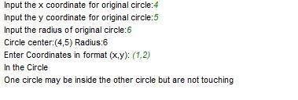

# This game in python use math package 

# Game is asking x and y co-ordinates  and radius
# It also ask co-ordinates in format (x,y) and tells if it is within the circle.
## This is the output of the game

